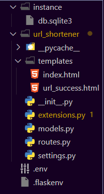
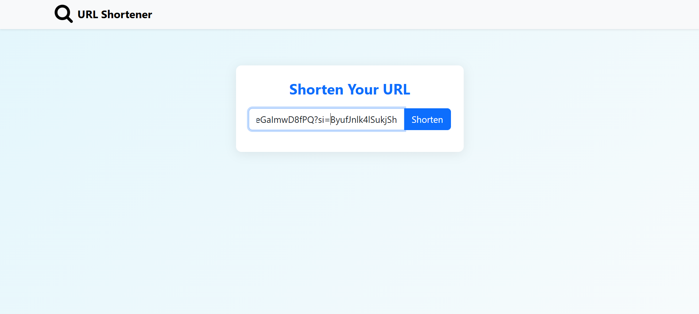
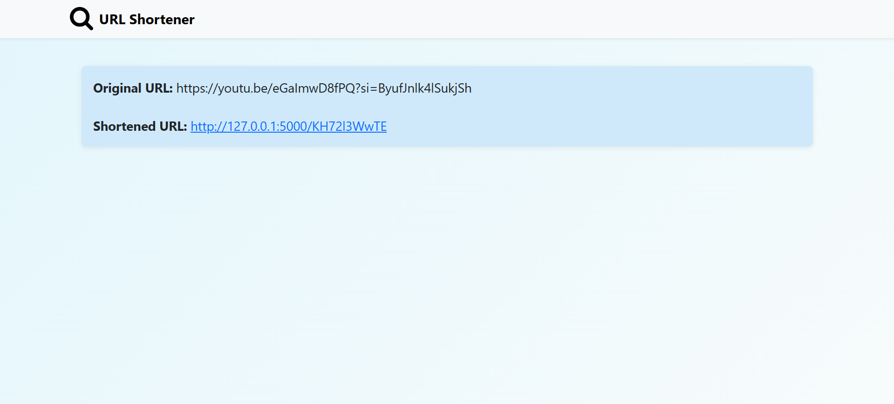

# URL Shortener

A simple **URL Shortener Web App** built using **Flask (Python), HTML/CSS, and SQLite**.  
It generates unique short links for long URLs, stores them in a database, and handles redirection seamlessly.

## 🚀 Features
- Shorten long URLs into clean, redirectable links.  
- Minimal and responsive UI (Bootstrap/HTML/CSS).

## 🛠️ Tech Stack
- **Backend:** Python, Flask  
- **Frontend:** HTML, CSS, Bootstrap  
- **Database:** SQLite

## 📂 Project Structure

## ⚙️ Installation

1. Before you begin, ensure you have Python 3.6 or later installed.

2. Clone the repository:
git clone https://github.com/Kartik-7813/url-shortener.git
cd url-shortener

3. Create and activate a virtual environment:
For macOS/Linux
python3 -m venv venv
source venv/bin/activate

For Windows
python -m venv venv
venv\Scripts\activate

4. Install the required packages:
pip install -r requirements.txt

5. Run the application:
flask run

6. Open in browser
http://127.0.0.1:5000/

## 🎯 Usage
- Enter a long URL in the input box
- Get a short URL instantly
- Visit the short URL to be redirected to the original link

## 📸 Screenshots

